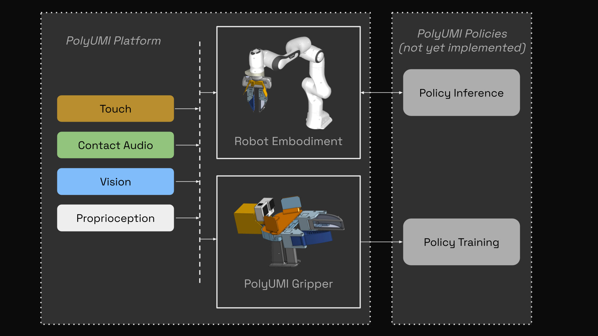

https://github.com/user-attachments/assets/2f902600-9682-4e67-a75c-fc8fa358cb92

# PolyUMI: Visual + Auditory + Tactile Manipulation Platform for Imitation Learning

**Project website:** https://cwoodhayes.github.io/projects/polyumi

PolyUMI is a real-time data collection & control platform for robotic imitation learning, which unifies the following sensor modalities in a single end-effector:
- **touch** (via a custom optical tactile-sensing finger, based off of [PolyTouch](https://polytouch.alanz.info/)) - *10fps 540x480 MJPEG video (MP4)*
- **mechanical vibration** (via a contact microphone fixed to the finger housing) - *16kHz PCM audio (WAV)*
- **vision** (via GoPro camera on wrist + finger camera peripheral vision) - *60fps 1920x1080 MJPEG video (MP4) + 10fps 540x480 MJPEG video*
- **proprioception** (via monocular inertial SLAM from GoPro + IMU in gripper, or robot joint encoders + FK in embodiments)

It combines the [Universal Manipulation Interface (UMI)](https://umi-gripper.github.io/) platform with a custom touch-sensing finger inspired by the [PolyTouch tactile + audio sensor](https://polytouch.alanz.info/), with hardware, firmware, and software built from scratch for a modern robotics stack (ROS2 Kilted + Python 3.13 + Foxglove visualizer).

<div align="center" style="display: flex; flex-wrap: wrap; gap: 12px; justify-content: center;">
  <div style="flex: 1 1 480px; min-width: 320px; max-width: 600px;">
    
    <p style="margin: 6px 0 0; font-size: 0.9em; color: #666;">Data flow through the PolyUMI system.</p>
  </div>
  <div style="flex: 1 1 480px; min-width: 320px; max-width: 600px;">
    
    <p style="margin: 6px 0 0; font-size: 0.9em; color: #666;">General summary of software components in this repo.</p>
  </div>
</div>

## Repo Structure

```
pi/               # RPi client: camera, audio, LED streaming + episode recording
postprocess/      # PC-side CLI: fetch sessions from Pi, encode video
ros2_ws/
  src/
    polyumi_pi_msgs/   # Protobuf message definitions (camera frame, audio chunk)
    polyumi_ros2/      # ROS 2 nodes + Foxglove launch files
```

## Prerequisites

**PC:** Python 3.13, [uv](https://github.com/astral-sh/uv), ROS 2 Kilted, `ffmpeg`, `protobuf-compiler`

**RPi:** Raspberry Pi Zero 2W flashed with Raspberry Pi OS. See [Hardware Notes](#hardware-notes) for HAT-specific config.

## Installation

### PC

Install postprocessing dependencies (includes the `polyumi_pi` package for shared data types):

```bash
uv sync --group dev
```

Build the ROS 2 workspace:

```bash
cd ros2_ws
rosdep install --from-paths src --ignore-src -r --rosdistro kilted
colcon build
source install/setup.bash
```

### RPi

> **First time setting up a new Pi?** See [docs/pi-provisioning.md](docs/pi-provisioning.md) for the automated cloud-init workflow that handles OS-level configuration (packages, audio HAT driver, PWM overlay, uv) before you run the steps below.

After the setup instructions for the gripper above, the `polyumi-pi` systemd service will run every time the Pi boots, enabling you to record right away by pressing the button on the audio HAT.


## Recording on the Gripper
1. Turn on the GoPro attached to the UMI (until it's turned on, the Pi will not let you record)
2. Turn on the Pi using the small button on the side of the PiSugar battery unit (short press, then long hold until all 4 LEDs light up, then release)
3. Wait until the red indicator LED on the audio HAT lights up red, indicating PolyUMI is ready to record. This may take 30-40 seconds after startup; the pi takes a while to boot.
4. Press the button on the audio HAT to start recording an episode; the LED will pulse and the GoPro will start recording; press the button again to stop recording. **Do not press the GoPro's shutter button or otherwise interact with the GoPro after powering it on; the pi will handle starting/stopping the GoPro's recording for synchronization.**

## Postprocessing

From the repo root:

```bash
cd postprocess
```

```bash
# Show all postprocessing commands:
python main.py --help
# Fetch only the latest session from the Pi:
python main.py fetch --host <pi_ssh_hostname> --latest
# Fetch all new sessions:
python main.py fetch --host <pi_ssh_hostname>
# Plug in the GoPro's SD card before running the fetch commands above to automatically fetch the GoPro's footage for each session
# OR download gopro footage from the SD later for all sessions you've fetched:
python main.py fetch-gopro --host <pi_ssh_hostname>

# PROCESSING SESSIONS ON DISK
# encode finger video+audio:
python main.py process-all 
```

## Streaming / Demos

### Streaming Demo

Streams camera, audio, and GoPro wrist camera into Foxglove.

On the Pi:

```bash
polyumi-pi stream
```

On the PC:

```bash
ros2 launch polyumi_ros2 stream_demo.launch.xml
```

Open [Foxglove](https://app.foxglove.dev), connect to `ws://localhost:8765`, and drag in `ros2_ws/src/polyumi_ros2/foxglove/layouts/stream_demo.json`.

The launch file accepts two arguments: `pi_host` (default `10.106.10.62`) and `video_device` (default `/dev/video2`) for the GoPro capture device.

## Hardware Notes

### PiSugar Battery

Battery status is accessible at `http://<pi_ip>:8421` or via I2C:

```bash
sudo i2cdetect -y 1
sudo i2cget -y 0x57 0x2a   # battery percentage; 100% = 0x64, 50% = 0x32, etc.
```

## Troubleshooting

**`_version.py` missing on the Pi** — run `./deploy.sh <pi_ssh_hostname>` from the PC; this generates the file from the current git HEAD.

**Audio not detected** — confirm `wm8960-soundcard` appears in `arecord -l`. If the default RaspiAudio driver was previously installed, the Waveshare DKMS driver may need to be reinstalled after a kernel update.

**Wi-Fi not listing on the Pi** — run `sudo modprobe brcmfmac`, then retry `nmcli dev wifi connect "your-network"`.

**ZMQ frames dropping** — check the `cb_drops` counter in the Pi logs. The audio streamer uses a 100-frame queue with drop-and-replace on overflow; the video streamer uses `NOBLOCK` sends with a high-watermark of 2. Persistent drops indicate the network link is the bottleneck.

**`protoc` not found during `polyumi_pi_msgs` install** — install `protobuf-compiler` (`sudo apt install protobuf-compiler` on the Pi, or via your system package manager on the PC).

**Audio issues:** Validate audio capture works on the pi with

```bash
arecord -D hw:wm8960soundcard -r 48000 -f S16_LE -c 2 -d 5 test.wav
```

## Development
### Developing the polyumi-pi app

To deploy the latest code to the Pi, run from the PC:

```bash
./deploy.sh <pi_ssh_hostname>
```

Then on the Pi, install the Python environment and the `polyumi-pi` script:

```bash
cd ~/PolyUMI/pi
# venv should have already been created by cloud-init, but run this if you need to recreate it for any reason (e.g. to pull in new system packages like picamera2):
# uv venv --system-site-packages
uv sync --no-dev
source .venv/bin/activate
```

`picamera2` must be installed via `apt`, not pip — the `--system-site-packages` flag above pulls it in from the system.
(this apt install & others is handled by the `cloud-init` [provisioning](docs/pi-provisioning.md) workflow).

**Tip for development:** add the `deploy.sh` invocation to `.vscode/tasks.json` as a build task so it runs with Ctrl+Shift+B.

Run `polyumi-pi --help` for a full list of commands.